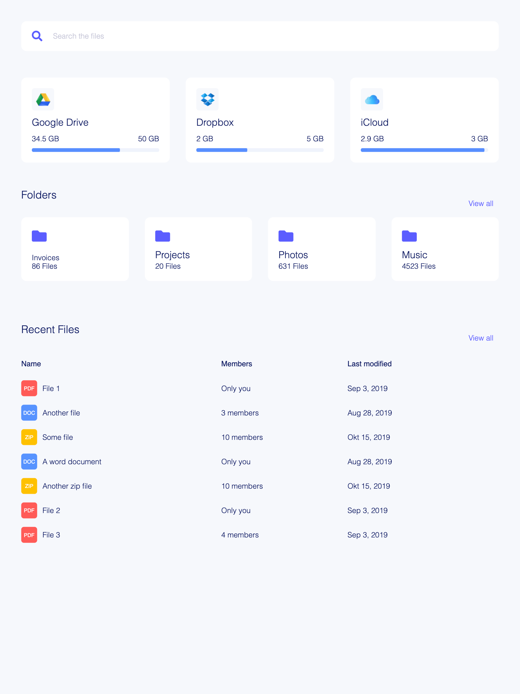

## Building and running on localhost

First install dependencies:

```sh
npm install
```

To run in hot module reloading mode:

```sh
npm start
```

## Assignment

### CSS

1. Add a Dropbox and iCloud card next to Google Drive. Use flexbox.

2. Create a section above "Recent Files", named "Folders", with 4 cards.

3. Clean up the CSS. Use BEM and SMACSS.

4. Make CSS more DRY and bundled. Use SCSS. Create a main.scss file in src/styles and add a link to HTML head to ./styles/main.css. Start SASS watcher with `yarn sass` or `npm run sass`

### DOM

1. Render the table dynamically with JavaScript, sort by last modified.

2. Implement the Search box. When the user starts typing show a list of 5 matching files in a dropdown.


